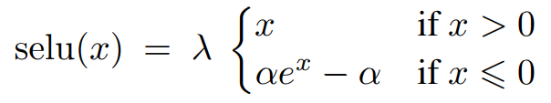

Over a 1000 publications and posters has been presented at NIPS2017. Here I would like to mention just a few most fascinating works. I believe that these publications have a fresh view on deep learning. They are promising a great deal of progress in the field.

The papers:
* [Self-Normalizing Neural Networks][1] by Günter Klambauer, Thomas Unterthiner, Andreas Mayr, Sepp Hochreiter
* [Dynamic Routing Between Capsules][2] by Sara Sabour, Nicholas Frosst, Geoffrey E Hinton
* [Eigen-Distortions of Hierarchical Representations][4] by Alexander Berardino, Johannes Ballé, Valero Laparra, Eero P. Simoncelli
* [Deep sets][3] by Manzil Zaheer, Satwik Kottur, Siamak Ravanbakhsh, Barnabas Poczos, Ruslan Salakhutdinov, Alexander Smola

[1]: https://arxiv.org/abs/1706.02515, "Self-Normalizing Neural Networks"
[2]: https://arxiv.org/abs/1710.09829, "Dynamic Routing Between Capsules"
[3]: https://arxiv.org/abs/1703.06114, "Deep sets"
[4]: https://arxiv.org/abs/1710.02266, "Eigen-Distortions of Hierarchical Representations"

#### [Self-Normalizing Neural Networks][1]
With that one the beauty unrolls on you gradually. Authors propose a new activation function as below.

which looks a lot like all other novel activation functions of the last decade. Just some combination of ELU and RELU with parameters. *As if we needed more parameters.*

The fascinating part comes here. With the hyperparameters α ≈ 1.6733 and λ ≈ 1.0507 and some fairly reasonable assumptions this activation function drags the weights to a point, at which neurons are likely to output zero mean unit variance distribution of activations. Boom! No Batch Normalization needed. And hyperparameter settings come as a bundle.

You might ask what is the point of replacing BatchNorm with something funky. Apparently this technique is a lot more appealing for fully-connected NN. Namely, it is a great help in applying deeper FCN to lower complexity problems. It pretty much makes FCN competitive on problems currently dominated by Random Forests, Boosted Trees and another Kagg
le-favorite models. I can not be more excited about it.

Disclaimer. Although paper is advertised a lot as a replacement of BatchNorm, it is strictly speaking not replacing anything. BatchNorm dominates CNN world and that part stays unchanged: SELU is not effective with convolutional layers because they break the assumptions about normality of perceptron inputs. SELU brings novelty into FCN, where BatchNorm, at least to my best knowledge, has not been that prominent.

#### [Dynamic Routing Between Capsules][2]

Another great rediscovery this year is Capsule Networks. First revealed to the public in pre-ResNet 2011 in paper [Transforming Auto-encoders](http://www.cs.toronto.edu/~fritz/absps/transauto6.pdf) by G. E. Hinton, A. Krizhevsky & S. D. Wang this technique waited for another 6 years to reappear as a strong contender. It is already reaching near-SOTA accuracies on MNIST and smallNORB and we might expect a lot more in the near feature.

The motivation comes from the shortcoming of the convolutional NNs. Namely, some of their strengths are their weaknesses. Convolutional filter, being an atomic building block of the networks, is too simple. It outputs a single floating point number and therefore imposes linear scalability of the representation power with the size of the model. Tying together multiple outputs like that (as, in a way, WideResNets are doing) promises exponential grows of the representational power.

Another CNN limitation comes from the position invariance. While we claim that higher levels of a net give us higher level of abstraction, it has implications. For example, if we would like to build an abstraction of a *face* from the abstractions of a *nose* and an *eye*, this would imply that we would need a separate convolutional filter for every relative position of these elements. Or we can just mesh them together regardless of the position with a MaxPooling layer. Non-ideal in both cases.

Capsules are a promising technique for manipulating a vectorized representation instead of single number representation. Conceptually, capsule output represents, first, probability of the concept (a nose) being present in the input, and second, initialization parameters of the concept. Initialization parameters, in 2011 terms, are a point on a representation manifold and might represent some mixture of object position, inherent properties and transformations.

The Dynamic Routing Between Capsules paper brings in a technique, to assemble the capsules in a multy-layer architecture. Dynamic Routing is an approach for replacing max-pooling in capsule paradigm. Namely, the authors introduce a flavor of a negotiation and voting mechanism that allows lower level capsule decide which higher level capsule to assign its output to. During this routing process lower level capsules increase a portion of the assignment weight for the higher level capsules that agrees more with their "view" (output parameters). It also can be viewed as reversed attention: instead of higher level entities selecting better-fit lower level inputs, lower level inputs deciding which higher level concept to commit to.

Beautiful paper. Beautiful idea. And it is always flattering to see new complex and insightful techniques emerge and change the world.

#### [Eigen-Distortions of Hierarchical Representations][4]

No, it does not get boring here.

Have you trained an autoencoder? Remember this decoding image you have as an output looking all blurry and unappealing yet close enough to produce low reconstruction error? This paper addresses exactly that pain point.

Authors not only design new and appealing perceptive loss function, they also develop a comparison technique, showing how numerically equal losses can be strikingly different in terms of subjective quality.

#### [Deep sets][3]

Deep sets extend the applicability of deep learning to wider variety of tasks. Normally, we deal with fixed dimensional problems like classification or regression i.e. predict single number or class for an input. Deep sets proposes a framework for working with set-like data.

Deep sets is a permutation invariant trick for NNs. CNNs bring positional invariance, which is a convenient way of dealing with visual data. RNNs introduce invariance to the size of the input to allow working with data series. Just like that, Deep Sets are intended to introduce invariance to permutation in input and, somewhat, output space of the NNs.

The paper covers mathematical background needed to design permutation invariant functions. Researches proof that to achieve desired properties function of set *x* should be representable in a form of a sum of projections of elements of *x*. They further argue projection function can be represented by a universal approximator in form a NN and simply apply summation on top of the set projections.

Results are astonishing. Researchers show that designed framework beats LSTMs in calculating population statistics. Shows competitive results on point cloud classification. They outperform existing methods in set extension (example: given a cluster, for instance words *{tiger, lion, cheetah}*, retrieve another element belonging to a cluster i.e. *jaguar*). They successfully apply the technique to image tagging (retrieving set of tag relevant to the image) and anomaly detection.
