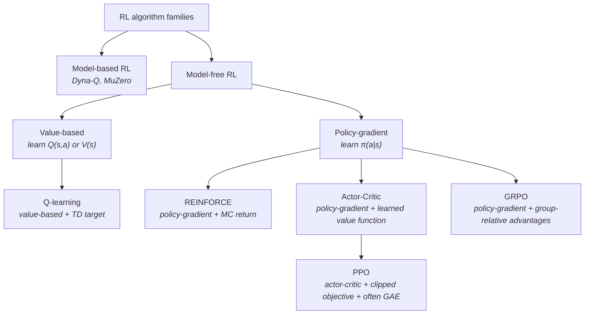
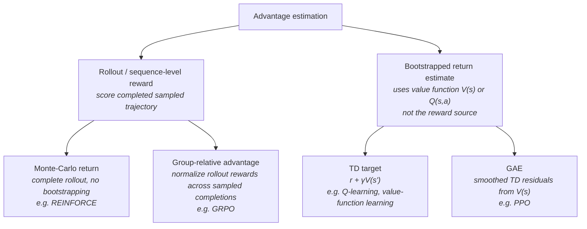
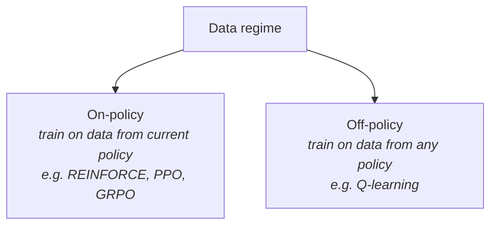
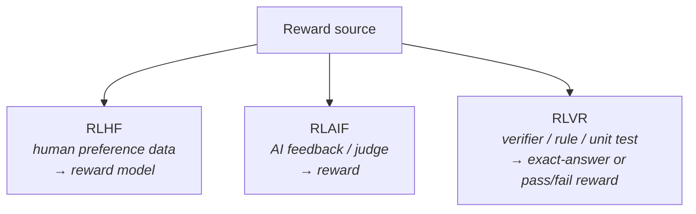

Engineering cheatsheet for RL terms frequently found in RL papers. 

## Locating PPO/GRPO in RL universe

Recent papers of RL training use PPO/GRPO training loop with RLAIF/RLVR. Which are model-free on-policy training methods reminiscent of REINFORCE with regularizations.

In **model-free** learning we don't try to create a model of the environment, instead we try to decide on the next **action** `a` based on the environment **state** `s`. Result of an action may receive a **reward** in some form `r` which is a proxy to the final outcome of a chain of actions. This - process of estimating reward/**value** of action instead of using final outcome directly - is called Temporal Difference (TD) learning. 

There are other types of RL. Dynamic Programming (DP) that creates a model of the environment. These first two are substantially different from TD methods. 

More often than not we have to sample a complete trajectory of multiple actions T before we can receive a reward i.e. it takes at least 2 steps to loose in tic-tac-toe. It means there exist only a single reward value per multiple policty decisions. In order to assign reward back to individual actions **advantage** is introduced. 

There are also twists on TD methods that have their own families. Actor-critic based learning uses an additional model to estimate a value function that can be trained alongside the policy. Trust-Region Policy Optimization (TRPO) adds a form of policy mixing, gradient clipping, or regularization. For the purposes of this crude review and simplicity we would mash them altogether and refer to them as `REINFORCE-like`. 

Q-learning and REINFORCE are 2 common types of TD. Q-learning learns a value function `Q(s, a)` that predicts reward (value) of each action for a given state. REINFORCE learns a **policy** distribution $\pi(a \mid s)$ - distribution over the space of actions for a given state. RL in LLMs leans towards REINFORCE-like on-policy learning.

When algorithm optimizes the policy using data sampled from that same (or very similar) policy we call it **on-policy** (REINFORCE). **Off-policy** optimization (Q-learning) can work without generating outputs from the policy. For example, by training from observed <state, action, reward, state_{t+1}> data points.

A lot of attention is given to the learning algorithm and the type of reward. Here we would take a shallow look at PPO (proximal-policy optimization algorithms) and GRPO (group-relative policy optimization) algorithms in conjunction with RLHF and RLVR (RL from human feedback and RL with verifiable reward).

## Distributions

Let's start from the optimization objective of GRPO: 
$$
J_{\mathrm{GRPO}}(\theta)
=
\mathbb{E}\!\left[
q \sim P(Q),\ \{o_i\}_{i=1}^{G} \sim \pi_{\theta_{\mathrm{old}}}(O \mid q)
\right]
$$

Reading it out loud: we are maximizing function $J$ depending on the set of training examples $Q$ in such a way that for resulting policy maximizes the reward over a group of outputs sampled from $O$. 

Let's break it down into the moving pieces:
- Sample $Q$ is coming from some sort of implied distribution of real data. Pretraining process already taken the best possible care of trying to incorporate that distribution in our SFT model that we are starting from.
- Policy $O$ is a distribution that we can sample from. GRPO operates on groups of samples
- $J$ is some reward function we are trying to maximize. In case of deepseek-R1 reward is higher if sample $o$ correctly answers a mathematical question and obeys a predefined format i.e. reward can be [0, 1, 2].

Sample distribution. We are starting from the training data $Q$ of some number of training examples `<prompt, output>`. We assume that they are sampled from some distribution $Q$ and maximize for that assumed distribution. This assumption of a distribution and i.i.d. sampling is our best technique to maximize performance on yet unseen samples i.e. during inference or on the validation set.

Then we have the policy. Policy is a distribution function. In our case it is an LLM with fixed architecture trained on data $Q$. We may say that given a prompt $p$ and our already trained LLM it produces a distribution of plausible output tokens. We have to take a detour here.

The final layer of an LLM is a logits function: it assigns a real value between [0,1] to each token in our vocabulary i.e. over a set of discrete values. By design sum of all the values it assigns is 1, which is sufficient to call it a probability distribution function. Logits outputs can be called probabilities, sure, but we actually love this function because it in practice never produces values of 0 and 1, while training labels are always 0 and 1. This means we can rely on it to never converge during training and generate a gradient for every token on every training step. We will get back to it later.

So, final layer of our trained LLM produces logits, which means we can say that trained model produces distribution of probabilities over our vocabulary given the tokens seen so far $\operatorname{LLM}(p_n)$. We can sample from it, fix the next token, and call it again $\operatorname{LLM}(p_{n+1})$, which, as you may have noticed, would produce a new probability distribution over our complete dictionary.

Now, back to logits. We pointed out earlier that logits always produce non-zero probabilities. For example there is a non-zero probability that `refrigir???` would be completed with token of a Thai word for mother `แม`. `refrigirแม`, a shortcut for saying `refrigimother`. Highly unlikely, but never impossible. Furthermore, the probability of the more likely completion `ator` would tend to be lower the larger the vocabulary. So, during sampling some prefer to only pick top-N most likely words or only most likely tokens that would account for $p$ percents of probability i.e. top-N and top-p sampling. After renormalizing probability of each word we get a new probability distribution that you again can sample from and in our case of `LLM("refrigir")` likely contains no Thai options.

There is another probability distribution in plain sight: distribution of output sequences given an input prompt $p$. If we repeat sampling of the next token $\operatorname{LLM}_{\mathrm{top\text{-}k}}(p)$ many times until we hit `END_OF_SEQUENCE` token it would be a probability distribution too. Distribution of output sequences over input prompt for a given trained model.

Back to GRPO formula. We now see that training examples $Q$ imply a probability distribution $P(Q)$ from which future user request $q$ would be sampled. And our optimization objective is to maximize a reward function over samples of output sequences $o(q)$ from a trained LLM.

One last thing. In GRPO optimization objective focuses on $\mathbb{E}[o_i^G]$ instead of a single example at a time. In GRPO the reward per example i.e. advantage is relative within a group of generated outputs for a single given prompt i.e. if 9 out of 10 generations came up with a correct solution of a mathematical problem each would receive a lower reward compared to a single correct output situation.   

## RL-universe 

In this section we are going to dive into Cambrian explosion of RL-terms. We would look at a morbidly complicated case resembling the original ChatGPT and its PPO with RLAIF architecture.

RL model that given current context produces action is called a policy. Example: in case of a single forward pass LLM call context is all previous tokens and action is predicted next token. In order to train the model we need some sort of reward. For next token prediction when we know exact next token we can use logits to produce the reward. In this case both policy and reward are differentiable. Some rewards are not differentiable: if a model produces an incorrect answer to mathematical problem we can not use an $L_2$ loss to backprop it back into the LLM. Some policies are not differentiable either. Sometimes we have to invoke the policy multiple times before we receive the reward: we need to produce at a minimum 2 turn decisions before winning or losing in tic-tac-toe. This further complicates distribution of reward value among the actions taken.

A trace of multiple policy invocations along with the invocation contexts is called a rollout.

Here are a few specific complications that arise when trying to distribute reward across actions:
- having a single reward value per multiple policy invocations i.e. rollout.
- having a non differentiable reward
- having a gamable reward. For example, you are training an AI to get better at playing doom. You reward it for passing a level as fast as possible. AI finds a gap in textures and catapulting to the end of the level. AI is rewarded for passing fast but does it make it "better at playing doom"?
- "vibes" rewards. How do you measure if LLM output is *appropriate*?

PPO with RLAIF tackles the issues with the following practical solutions:
- reward model. Use another model to generate the reward (turtles all the way down). For example, we can train text classifier to judge if a model output is **appropriate** and use it to generate rewards per policy output.
- use KL-divergence to regularize training process (to the best of our mathematical abilities). For example, we can use KL-divergence to penalize models for changing distribution of output tokens i.e. inventing a reduced language that would allow them to hack the reward model. Since KL-divergence works on 2 distributions we typically need 2 policies, hence PPO introduces a reference policy. Reference policy can be the model you started your training from.
- Value model. Reward model itself is not necessarily sufficient to tell the learning process which action should be taken and which to be avoided. Value model produces a reward score per example that can be used to incentivise policy behaviour. For example, the model may learn to produce an answer of **appropriate=1.7** which would be considered undesirable if value model (untrained, or lagging model) is producing **1.9** on the same example.

This is how we end up with 5 models: 3 policies and 2 extra model. 

Different papers may refer to these components using different names:
- current policy a.k.a. trainable policy: the LLM being updated. Can sometimes be also be seen as simply policy, actor, trainable policy, or, in off-policy work, target policy.
- old policy a.k.a. behavior policy a.k.a. rollout policy a.k.a. sampling policy: the frozen snapshot that produced the sampled outputs for this PPO update
- reference policy a.k.a. KL anchor a.k.a. prior policy: a frozen model, usually the SFT model in RLHF, used only for KL regularization
- reward model - scores policy outputs
- value model a.k.a. critic - provides a reference value (score) for an input. Can be a policy output of which is scored by a reward model, but in conjunction it is no longer a policy.

Quite complicated but well worth the trouble when you are literally inventing ChatGPT.

## GRPO with RLVR

Now we would look at GRPO again to repeat all the concepts we just introduced and hopefully simplify the picture somewhat.

Solution 1: get rid of the hackable reward function. Instead of introducing a reward model that requires all sorts of handholding GRPO introduces RLVR - Reinforcement Learning from Verifiable Reward. In their case it is an answer to a mathematical problem. Other verifiable problems: code correctness, valid parentheses. Correct answer gives model reward of 1.

They also allow model to think freely between <think> tokens. Obeying this output format increases reward by 1 again.

Solution 2: Get rid of value model. Given the binary nature of the training signal it would probably slow down training anyway. Instead of using an extra model to dictate which rollout is desirable and which is not they stack-rank multiple responses against each other within a batch of generations i.e. each reward is subtracted by the mean of current batch and divided by standard deviation.  

KL-divergence - this one is still there.

## KL-divergence

We start from a probability density function (PDF, doesn't have anything to do with holding hands). A glorified normalized histogram. Here are a couple of PDFs of normal distributions:

KL-divergence measures how much one probability distribution differs from another. For distributions P and Q it is defined as:

$$
D_{\mathrm{KL}}(P \| Q) = \sum_{x} P(x) \log \frac{P(x)}{Q(x)}
$$

i.e. for continuous distributions: $D_{\mathrm{KL}}(P \| Q) = \int p(x) \log \frac{p(x)}{q(x)}\,dx$. Somewhat not intuitive from the formula is the fact that $D_{\mathrm{KL}} \geq 0$, which comes from the PDF normalization property $\int p(x)\,dx = 1$ and Jensen inequality.

Note that $D_{\mathrm{KL}}(P \| Q) \neq D_{\mathrm{KL}}(Q \| P)$: it is not symmetric. $D_{\mathrm{KL}} = 0$ when the two distributions are identical, and grows as they diverge.

Now, how does it work in practice. Things are going to get goofy real quick here.

KL regularization as used in PPO:
1. First, we apply KL to a distribution over the vocabulary. So, we take the integral over a set of discrete values, no big deal.
2. Second, we apply KL on a per-token basis. For every token generated along the rollout trajectory derive probabilities for the same position from the reference model i.e. tokens sampled before or after don't affect KL of current position.
3. Third, when taking the integral we don't consider the complete vocabulary. Instead, we only calculate loss over a single position of the sampled token i.e. KL of literally 2 numbers, say, 25% and 37%. It does simplify the computation a lot, and does make more sense to only regularize over the sampled trajectory (vs all the tokens considered but never actually used). It is also turns KL into a simplistic $log(x/y)$.
4. At last, as a regularization term, it is multiplied by a small constant value before adding to the total loss. In case of DeepSeek-R1 the value is 0.01. Some models average KL instead of adding it, which further dilutes KL loss by the length of the sequence.

How do we interpret that? At large, model is incentivised to match reference distribution exactly i.e. produce the same most likely token(s) for every position since this is the direction of getting closer to $D_{\mathrm{KL}}=0$. KL is indifferent to the type of sampling we use during generating the trajectory. Separately, I would argue that probabilities are more likely to get redistributed among most likely tokens. For example, say we have a vocabulary of 100 tokens and next-token prediction assigns 9 of them probability of 10% and the remaining 10% is evenly shared among the other 91 tokens. Let's refer to them as 9 likely and 91 unlikely tokens. Moving a 1% of probability from a likely token to other likely token would produce $D_{\mathrm{KL}}=0.001$ while moving 1% from likely to unlikely token produces $D_{\mathrm{KL}}$ 16 times higher.
