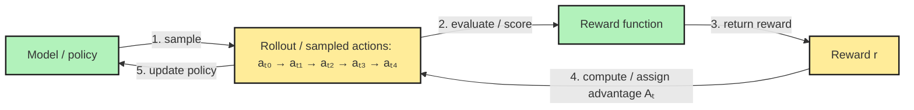
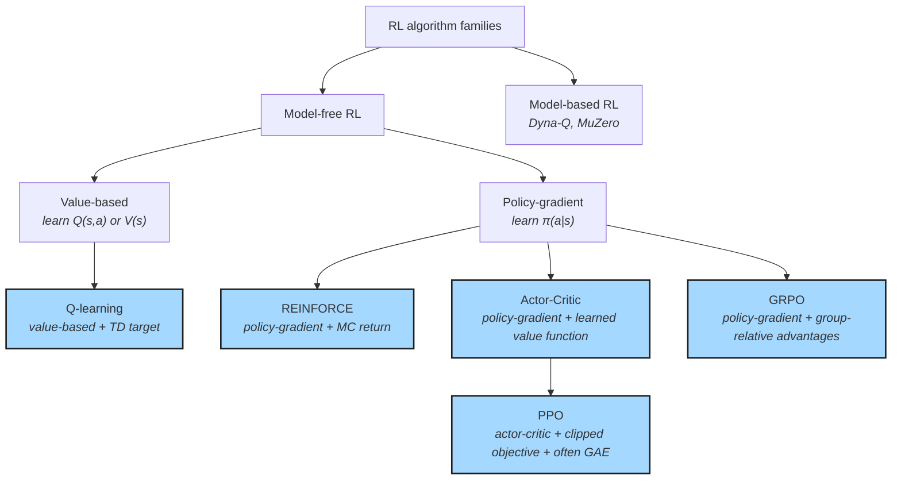
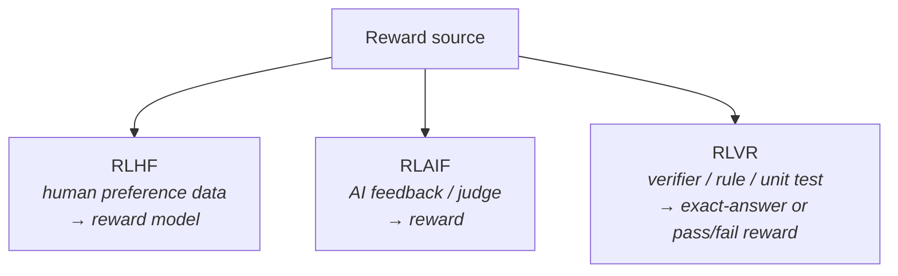
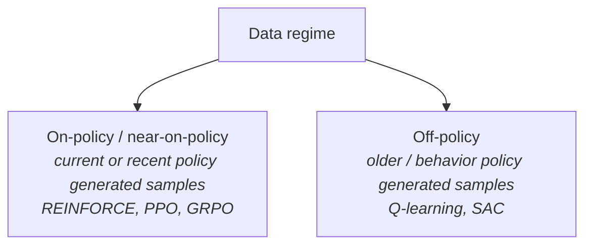
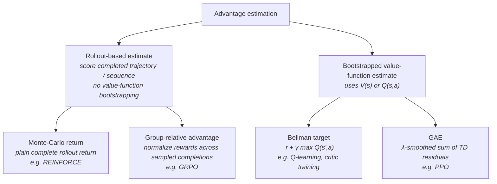

Engineering cheatsheet for RL terms frequently found in RL papers and how they relate to each other. This is the article I would re-read opening an RL article after a 12 months hiatus.


## Intro

Let's take a look at a quick summary of a modern PPO update rule:

```
PPO is a model-free actor-critic policy-gradient method: 
it trains a policy with a clipped policy-gradient 
objective, and usually trains a critic 
that can provide bootstrapped value estimates, 
commonly through GAE.
```

Even when each term in the definition may be familiar to the reader or can be explained through reading the source paper it may be hard to connect the pieces together. For instance, the single-sentence definition above mixes a broad term *model-free* and a minute detail of the technique: *clipped policy-gradient*. 

This article provides a structure to approaching RL techniques. 

We propose the following 5 independent or semi-independent dichotomies for classifying core RL training techniques:
1. Model being trained
2. Update algorithm used
3. Type of Reward
4. Source of data used in RL
5. The way reward is attributed to particular actions.

To prevent this article from growing into a PhD thesis we would emphasise recently relevant techniques such as ones used in DeepSeek-R1 and early ChatGPT models. We do not attempt to explain every term you see, but we hope to greatly reduce the necessity to hop between papers by providing a backbone for classifying RL techniques.  

## Abstract RL training

Let's start from an abstract representation of an RL training:



We train a **model** or a **policy**. During training we rollout a sequence of **actions** that model takes to arrive to some terminal state. In case of LLM that would be a sequence of tokens until we hit EOS. In case of tic-tac-toe game it would be a sequence of 2 to 5 actions to arrive to one of 3 outcomes: win, lose, or draw. The whole sequence is referred to as **rollout**. The length of sequence is often referred to as **time**.

**Reward function** scores part or complete sequence and produces a **reward**. Reward can be used to assign the contribution to each action i.e. **advantage**. At last, model is updated based on the advantages each action received.


## Types of models & update rules

First, there is a family of models that try to create a model of the world. Probabilistic Graphical Models attempt to encapsulate the world in a set of joint probability distributions. Model of a triple pendulum may already encapsulate how it works and only try to learn the parameters of the specific pendulum. 

Unlike model-based techniques, **PPO** and **GRPO** are **model-free**. They do not try to create a model of the world.

The second most important distinction is what the model is trying to learn. At every point in time we work with the current **state** of the environment `s` and a set of possible **actions** `a`. **Value-based** learners predict expected value of each action directly, for example in Q-learning `Q(s, a) -> R`. **Policy-based** learners create a distribution over the set of actions instead $\pi(a\|s)$.

Let's chew on it. LLM predicting next token is a stochastic policy: it outputs a distribution of probabilities over the complete dictionary (typically only a few tokens are assigned probabilities greater than `0.1%`). Top-3 sampling from the same LLM prediction is a policy again: we normalize probabilities over the top-3 tokens and can sample from this probability distribution over 3 actions. 

The line between value-based methods and policy-based methods are somewhat blurry. For a given value function it is easy to create a policy, for example, assign 100% probability to the action with highest expected value. In my understanding Q-learning is better suited when Bellman target can be estimated more or less directly from actions and their outcomes. Policy-gradient family imposes no restriction on how model is updated based on the reward rollouts receive, which creates greater freedom to use looser defined reward functions, odd-looking model update rules, and mix-and-match different rewards and incentives. 




The family of policy-gradient **update rules** (or algorithms) is pretty big and members often share techniques and regularizations between each other. Let's name a couple. REINFORCE incentivises actions that lead to higher sequence reward. Actor-critic based learning trains an additional **critic** model that is trained to estimate value or advantage; critic can also improve / co-train as the training progresses akin to schedule based learning. GRPO normalizes the reward value across multiple rollouts before the update.

Reward source, types of regularization techniques being used, and method for assigning advantages to specific action are not prescribed by the type of update rule. PPO [[1707.06347](https://arxiv.org/abs/1707.06347)] is a form of actor-critic style training. It adds trust-region clipping [[1502.05477](https://arxiv.org/abs/1502.05477)] and often uses GAE [[1506.02438](https://arxiv.org/abs/1506.02438)]. OpenAI also used reward assignment in form of reinforcement learning from human preferences (RLHF) [[1706.03741](https://arxiv.org/abs/1706.03741)]. As you may have noticed none of these papers are particularly new, nor unique to PPO or policy-gradient methods. 

## Reward types

RL from human preferences originates from 2017 RLHF (F for feedback) paper [[1706.03741](https://arxiv.org/abs/1706.03741)]. The original paper used Human Feedback in an online manner: model produces multiple trajectories and human in the loop selects the preferred one. Contrary to that ChatGPT training afaict used pairs of human preferences in an offline setting.

RLAIF replaces human annotator with AI. Anthropic's Constitutional AI is one form of RLAIF: train a model (one or many) to evaluate if the answer obeys an arbitrary concept. For a given offline dataset of human preferences it is always possible to train a **judge** model to provide feedback on any trajectory instead of relying on the original RLHF dataset itself.

RLVR uses a verifiable reward [[2506.14245](https://arxiv.org/abs/2506.14245)]. The reward is produced by a **verifier** — a deterministic function or **rule** that checks correctness. DeepSeek-R1 used rule-based rewards, including correctness rewards and format rewards. For math-style tasks, the final answer can be compared to the correct solution by a **verifier** to assign an exact-answer reward (0 or 1) to the full trajectory.




## Data regime

When algorithm optimizes the policy using data sampled from that same (or very similar) policy we call it **on-policy** (REINFORCE). **Off-policy** optimization (Q-learning) can work without generating outputs from the policy. For example, by training from observed $(s, a, r, s_{t+1})$ data points alone.

For example, a policy may generate a trajectory and receive the reward from an AI judge for its own output. This makes it on-policy or near-on-policy training. While if we train a model directly on fixed human-preference pairs, the examples have not been generated by the policy itself and the data regime is therefore offline, or off-policy if used as an RL update.




The line between on-policy and off-policy may get blurry in LLM training. The model from a few updates ago may be considered "very similar" and training would be assumed on-policy. Some even perform distillation from larger models using per-token losses to incentivise student model to be more like teacher model and still call it on-policy.

## Rollout and Advantage estimator

It takes more than one-turn to win or lose in tic-tac-toe. Reward more often than not can only be assigned to a complete rollout. Advantage takes care of distributing the reward back to individual actions.

In Q-learning in state $s$ we take action $a$ which takes us to state $s'$: $(s, a, r, s')$. Q-function from $s'$ can predict max future value from the next state: $\max_{a'} Q(s', a')$. It then applies discount factor $\gamma$ to translate the future value to the previous action. So, if we take action $a$ with immediate reward of `-1` and it takes us to state $s'$ with maximum future value of `8` with discount factor of `0.9`, we get that the value of action $a$ is `-1 + 0.9 × 8 = 6.2`.

Q-learning in this case does not perform a complete rollout and estimates return from the predicted maximum future value of the next state. This process is called **bootstrapping**: estimating value for intermediate portions of the sequence.


GRPO is a **Monte-Carlo** (MC) based update rule. Reward is ever only assigned to a complete rollout. In case of GRPO reward is normalized within the group and for a specific rollout reward is broadcast to each action i.e. within the sequence every action gets the same advantage.

ChatGPT-style PPO advantage estimation is bootstrapped. PPO assigns signed advantages per action by comparing the rollout return / estimated return to the critic’s value estimate for that state. PPO does not have to rely only on the final sequence reward to assign credit to an action.

<!-- hen estimated value of the rollout is higher than critic's value i.e. incentivises only actions that are better than baseline. It then says that out of all actions `a_0, a_1, ..., a_N` we would attribute higher advantage to actions that are more different from the old policy i.e. if old model assigns 20% to action `a_7` and current policy assigns 40% to action `a_7` PPO assumes that this action is the one that helped model beat the critic and gives it a ratio of `0.20/0.40=2` (and then clips it back to `1.1` for a 10% confidence interval, but this is another story). So it may look a lot like an MC method. But we have to point out that rewards are assigned to actions `a_0, a_1, ..., a_N` vs critic during rollout before we observe the end of the sequence, which makes it a **bootstrapping** method. -->




## Conclusion

Let's revisit the definition from above:

```
PPO is a model-free actor-critic policy-gradient method: 
it trains a policy with a clipped policy-gradient 
objective, and usually trains a critic 
that can provide bootstrapped value estimates, 
commonly through GAE.
```

We were successful at explaining 7 out of 9 concepts in the definition, and at explaining which ones are related to each other. We are only short of explaining `clipped policy-gradient` and `GAE` - information that can be filled in with 2 google searches.

