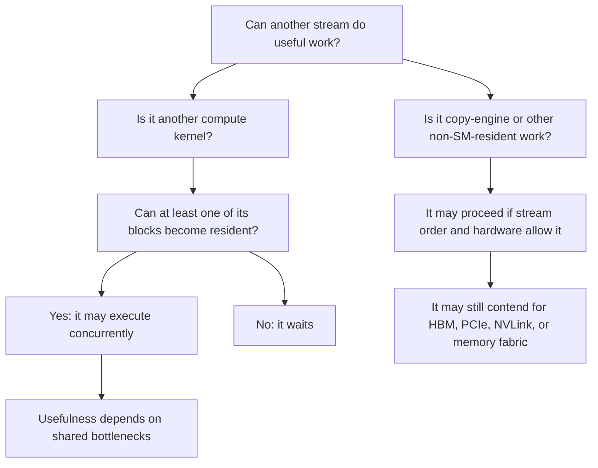

Most training code has a simple single-stream interpretation: work queued to the stream executes in order. If Kernel A is followed by Kernel B in the same stream, B is not allowed to start only because some SMs are idle. Multiple streams remove this ordering edge. They do not create SM slots, registers, shared memory, HBM bandwidth, or copy-engine bandwidth.

This article is about the remaining condition after the stream dependency is removed. A second compute kernel can run while the first one is running only if one of its thread blocks can become resident on an SM. Once the block is resident, its warps can compete for issue opportunities. Before that point, idle Tensor Cores, idle FP32 pipes, or warps stalled on memory inside the first kernel are not resources the second kernel can use.

## Stream, kernel, block

A CUDA stream executes queued GPU operations in the order they were queued. The operation can be a kernel launch, a memory copy, an event, or another CUDA operation associated with the stream. For the compute case, the important rule is simple: kernels submitted to the same stream are ordered with respect to each other. The host call that launches a kernel may return before the kernel finishes, but later work in the same stream remains behind it in the stream order.[^cuda-streams]

A kernel is a GPU function together with a launch geometry. The function body is written once, but the launch instantiates it across a grid of thread blocks. In CUDA C++ this is visible in the launch syntax:

```cpp
kernel<<<grid, block, shared_mem_size, stream>>>(...);
```

The `grid` argument specifies the number of blocks. The `block` argument specifies the number of threads inside each block. Both can be one-, two-, or three-dimensional. If the grid is `M x N x K` blocks and each block has `D` threads, the launch creates `M * N * K` blocks, each with `D` threads. Every thread executes the kernel code and can read built-in indices such as `blockIdx` and `threadIdx`, which give it a distinct position inside the launch.[^cuda-programming-model]

```text
kernel launch
    |
    v
grid
 +-- block 0
 +-- block 1
 +-- block 2
 +-- ...
```

A thread block is the placement unit. All threads of a block execute on one SM, share the block's shared-memory allocation, and can synchronize with block-level barriers. A grid can contain more blocks than the GPU can run at once, so blocks are assigned to SMs in waves. CUDA does not give an ordering guarantee between blocks in the same grid, which is why a block should not depend on another block from the same grid finishing first.[^cuda-programming-model]

Within a block, threads are grouped into warps of 32 threads. A warp is the SIMT execution group: the warp executes one instruction across lanes, with lanes masked off when control flow diverges. The SM scheduler selects ready resident warps and issues their instructions to the available pipelines.[^cuda-programming-model]

```text
GPU
 +-- SM 0
 |    +-- resident block
 |    |    +-- warp 0: 32 threads
 |    |    +-- warp 1: 32 threads
 |    |    +-- ...
 |    +-- resident block
 +-- SM 1
 +-- ...
```

The placement rule is the part to keep:

```text
A block lives on one SM.
An SM may hold multiple resident blocks.
Resident blocks may come from one kernel or from multiple kernels.
```

## H100 resource numbers

The examples below use H100 SXM5. The model does not depend on Hopper, but the numbers make the constraints concrete. Full GH100 has 144 SMs. H100 SXM5 exposes 132 SMs, while H100 PCIe exposes 114 SMs. H100 SXM5 has 528 fourth-generation Tensor Cores because it exposes 132 SMs and the H100 SM has 4 Tensor Cores per SM. H100 also has a 50 MB L2 cache.[^hopper-blog]

For H100 / compute capability 9.0, one SM supports the following residency limits, subject to the other limits being satisfied:

```text
32 resident thread blocks
64 resident warps (2,048 resident threads)
65,536 32-bit registers
228 KB shared memory

Per block: 227 KB max shared memory, 1,024 max threads
```

## Residency resources

An SM can accept another block only if every required residency resource has enough remaining capacity. Thread slots, warp slots, and block slots are counted at the SM level. Registers are allocated per thread. Shared memory is allocated per block. CUDA's programming model makes this distinction explicit: the total registers required by a block must fit in the SM register file, while shared-memory allocation is common to the entire thread block.[^cuda-programming-model]

For example:

```text
256 threads/block * 64 registers/thread
= 16,384 registers/block
```

An H100 SM has 65,536 32-bit registers. Ignoring allocation granularity, registers alone limit this kernel to:

```text
65,536 / 16,384 = 4 resident blocks / SM
```

The same block also consumes 256 threads, or 8 warps. The thread limit would allow 8 such blocks per SM, and the warp limit would also allow 8 such blocks per SM:

```text
2,048 threads / 256 threads/block = 8 blocks / SM
64 warps / 8 warps/block = 8 blocks / SM
```

The register limit is tighter. The kernel gets at most 4 resident blocks per SM before shared memory and block slots matter.

Now change only the block size:

```text
1,024 threads/block * 64 registers/thread
= 65,536 registers/block
```

One block now consumes the full register file of the SM. It also consumes only 32 of 64 warp slots.

```text
SM 0:
    A block
    registers: full
    warp slots: 32 / 64
```

The SM has unused warp slots. It may also have unused issue slots. Another block still cannot become resident if it needs registers. This is the first distinction the concurrency model needs:

```text
Idle execution capacity does not imply residency capacity.
A non-resident kernel has no warps to issue.
```

## Resource occupancy of one kernel

Before looking at multiple streams, it is useful to separate the ways a single kernel can occupy the GPU. A kernel may reach every SM, exhaust a residency resource, or saturate a shared bottleneck. These are often collapsed into the phrase "uses the whole GPU", but they have different consequences for concurrency.

A kernel reaches every SM when it has enough long-running blocks to place at least one block on every SM. On H100 SXM5, a kernel with at least 132 blocks can do this, assuming each block fits.

```text
H100 SXM5:
    132 SMs

Kernel A:
    132+ blocks

Possible first wave:
    SM 0:   A block
    SM 1:   A block
    ...
    SM 131: A block
```

This uses the full SM set. It does not imply that every SM is full. If each A block is small, the SM may still have room for more blocks.

A different case is a kernel that exhausts a residency resource. The 1,024-thread, 64-register example consumes the full register file with one block. If every SM gets one such block, no block from another compute kernel can become resident through that register-file path.

```text
SM 0:
    A block
    registers: full
    warp slots: 32 / 64
    B block: cannot become resident
```

Shared memory can create the same outcome:

```text
Kernel A block:
    220 KB shared memory/block

H100 SM:
    228 KB shared memory/SM

Result:
    one A block fits
    another large block does not
```

In both cases, Kernel B waits because B has no resident block. The reason is not that the SM has no arithmetic instruction it could issue.

A third case is a kernel that leaves residency resources available but saturates a broader bottleneck. A streaming memory kernel may leave room for another block and still saturate HBM bandwidth. Another kernel can become resident, but it may only compete for the same memory system. L2 behaves similarly at the level of usefulness rather than residency: L2 is shared across the GPU, while registers and shared memory are SM-local residency resources.[^cuda-programming-model][^hopper-tuning]

The useful split is:

```text
registers/shared memory/thread slots/warp slots/block slots:
    decide whether another block can become resident

L2/HBM/NVLink/PCIe/copy engines:
    decide whether overlap is useful once work can run
```

So "uses the whole GPU" is not one state. It can mean reaching every SM, exhausting residency resources, saturating Tensor Cores, saturating FP32 issue, saturating HBM, or destroying useful L2 locality. These states lead to different overlap behavior.

## Multiple streams: vacant SMs

The first form of stream parallelism is the case where the first kernel does not occupy the full SM set. If Kernel A has 80 long-running blocks on H100 SXM5, at most 80 SMs need to host an A block. The remaining SMs can accept blocks from another stream, assuming stream order permits Kernel B to be considered.

```text
H100 SXM5:
    132 SMs

Kernel A:
    80 long-running blocks

Possible placement:
    SM 0:   A block
    SM 1:   A block
    ...
    SM 79:  A block
    SM 80:  vacant
    ...
    SM 131: vacant
```

Kernel B can use the vacant SMs:

```text
SM 80:  B block
SM 81:  B block
...
SM 131: B block
```

This is not a special property of streams. The stream only removes the ordering dependency. The hardware reason B can run is that B has a place to put blocks.

If A and B are in the same stream, B waits even if SMs are vacant:

```text
Stream 0:
    Kernel A -> Kernel B
```

If A and B are in different streams, stream order no longer forces B behind A:

```text
Stream 0:
    Kernel A

Stream 1:
    Kernel B
```

The runtime can then select work from streams that have available work, depending on GPU resources.[^cuda-streams]

## Multiple streams: co-residency on occupied SMs

The second form of compute concurrency is more important. Every SM may already have a block from Kernel A, and Kernel B may still run if a B block fits into the remaining residency resources of an occupied SM.

```text
SM 0: [A block] [B block]
SM 1: [A block] [B block]
SM 2: [A block] [A block] [B block]
```

For example, suppose Kernel A has 132 blocks on H100 SXM5, each with 256 threads, 64 registers per thread, and small shared-memory use. A can place one block on each SM. Each A block consumes:

```text
256 threads
8 warps
16,384 registers
```

Each H100 SM has:

```text
2,048 thread slots
64 warp slots
65,536 registers
32 block slots
```

After one A block, the approximate remaining capacity on the SM is:

```text
1,792 thread slots
56 warp slots
49,152 registers
31 block slots
most shared memory
```

A B block can become resident if it fits in that remaining capacity. In this case, all SMs are occupied, but the GPU is not closed to another compute kernel.

The rule is:

```text
All SMs occupied does not imply no compute concurrency.
Residency resources exhausted implies no compute concurrency.
```

This is why occupancy is relevant beyond latency hiding. Occupancy exposes which resource prevents another block from becoming resident. It does not by itself predict performance, but it helps answer whether another kernel has a place to live.

There is a scheduling caveat. If Kernel A has many blocks waiting, the runtime may keep placing more A blocks before Kernel B gets useful residency. Concurrent execution is allowed when resources permit it. It is not a fairness guarantee.

## Residency and idle cycles

A memory-bound kernel may occupy every SM while many resident warps wait on memory. The SM scheduler can hide some of this latency by issuing instructions from other ready resident warps.

```text
SM 0 resident warps:
    A0: global load -> waiting
    A1: global load -> waiting
    A2: ready
    A3: waiting

Scheduler:
    issue A2
    issue A7
    issue A11
```

A second kernel helps only after its blocks become resident. Once B has resident warps, those warps join the same pool of candidates for issue:

```text
Resident warps:
    A0 A1 A2 A3 ...
    B0 B1 B2 ...

Scheduler:
    issue A2
    issue B1
    issue B2
    issue A7
```

If no B block can become resident, B contributes no ready warps.

```text
64 / 64 warp slots occupied
A warps mostly waiting on memory
FP32 units idle
issue slots idle

Kernel B still cannot run
because no B block is resident.
```

The wrong model is:

```text
A leaves issue slots idle, therefore B can use them.
```

The correct model is:

```text
A leaves issue slots idle.
B can use them only if B first gets resident warps onto the SM.
```

## Tensor Core-heavy kernels

A Tensor Core-heavy kernel may leave other execution resources less used. For example, a GEMM kernel may primarily stress Tensor Cores and the operand paths that feed them, while scalar FP32 or INT pipelines are less used.

```text
Kernel A: Tensor Core-heavy
Kernel B: INT-heavy or scalar FP32-heavy
```

This can be useful only after the same residency test passes. If a B block cannot become resident, B has no resident warps and cannot use the idle scalar capacity. If B can become resident, the two kernels may use complementary execution resources, but they still share warp schedulers, register file capacity, shared memory, L1/shared-memory capacity, L2, HBM, interconnect traffic, and power limits.

The practical rule is:

```text
Residency determines whether overlap is possible.
Shared bottlenecks determine whether overlap is useful.
```

This is why "Tensor Cores are busy and CUDA cores are idle" is not enough to prove that a second kernel improves throughput. The second kernel still has to fit, issue, and avoid the bottleneck that limits the first kernel.

## Work that does not need new compute residency

Not all useful work is another compute kernel. A host-to-device or device-to-host copy issued with `cudaMemcpyAsync` can overlap with kernel execution when stream order, memory operands, and hardware support it. For host memory, real asynchronous behavior requires pinned page-locked memory; otherwise `cudaMemcpyAsync` may fall back to synchronous behavior and fail to overlap with other work.[^cuda-streams]

```text
Stream 0:
    compute kernel using all SM residency

Stream 1:
    cudaMemcpyAsync H2D or D2H
```

This is a different resource path from compute co-residency:

```text
second compute kernel:
    needs block residency on SMs

async copy:
    may use copy engines / transfer paths
    may still contend for PCIe, NVLink, HBM, or memory fabric
```

Stream order still applies. If a copy is queued behind a compute kernel in the same stream, and that compute kernel is waiting for residency, the copy waits behind it.

```text
Stream 1:
    Kernel B -> H2D copy
```

To overlap the copy with another stream's compute, the dependency graph has to expose the copy before the blocked work or place it in another independent stream.

```text
Stream 1:
    H2D copy -> Kernel B
```

or:

```text
Stream 1:
    Kernel B

Stream 2:
    H2D copy
```

## TMA

Hopper's Tensor Memory Accelerator, or TMA, belongs to a different category from `cudaMemcpyAsync`. TMA is used by a resident kernel to move tensors between global memory and shared memory, in both directions, and to move data between shared-memory regions of SMs in the same cluster. NVIDIA describes TMA as allowing a single thread to issue a large tensor movement while avoiding registers and SM instructions for the movement itself.[^hopper-tuning]

A useful model is:

```text
manual copy inside kernel:
    many threads issue load/store instructions
    copied values may occupy registers
    SM instruction issue is consumed

TMA copy inside kernel:
    one thread issues bulk tensor movement
    TMA moves data asynchronously
    block can overlap independent work
```

TMA is therefore in-kernel parallelism. It helps a resident block overlap data movement with other work performed by that block or by related blocks. It is not a stream-level path that lets future work make progress without a resident kernel.

Bad model:

```text
Stream 0:
    compute kernel consumes all SM residency

Stream 1:
    future TMA work advances anyway
```

Better model:

```text
Stream 0:
    resident kernel uses TMA internally

Stream 1:
    kernel that would use TMA still needs residency first
```

So TMA should not be grouped with copy-engine work just because both are asynchronous. Copy-engine work may be a separate queued operation. TMA is a mechanism used by a running kernel.

## NCCL and communication streams

A communication stream does not imply copy-engine work. Many communication operations are implemented as GPU kernels and can consume SM resources. Newer NCCL releases also include copy-engine-based collectives for some data-movement collectives. NVIDIA describes NCCL 2.28 CE-based collectives as zero-SM operation for collectives such as AllToAll and AllGather within the NVLink domain.[^nccl-ce]

The safe model is:

```text
communication stream operation:
    may be an SM-resident kernel
    may be copy-engine work
    may use NVLink / PCIe / network
    may contend for HBM
```

For distributed training, this is why profiling matters. The same high-level line of code can map to a different resource path across NCCL versions, topology, collective type, message size, and environment settings.

## Caveats

The legacy default stream can remove concurrency by introducing synchronization with blocking streams. CUDA documents that the runtime can select tasks from multiple streams depending on available GPU resources, but default-stream semantics and blocking streams can add ordering where the code did not make it visually obvious.[^cuda-streams]

Stream priority is also not preemption. CUDA stream priority is a scheduling hint and does not guarantee execution order. A high-priority kernel can still wait if no block can become resident.[^cuda-streams]

The compute-capability table lists a maximum number of resident grids per device for concurrent kernel execution. For compute capability 9.0, the limit is 128. This is a ceiling, not a promise that 128 useful kernels will run together. Each kernel still needs at least one block that fits somewhere.[^compute-capability]

Occupancy is not utilization. Occupancy counts resident warps relative to the hardware maximum. Utilization asks what the hardware actually did over time. A kernel can have high occupancy and low issue efficiency, or lower occupancy and high Tensor Core utilization. For concurrency, occupancy is useful because it exposes residency pressure.

Thread block clusters add another placement constraint on Hopper. A cluster groups blocks and schedules them with locality constraints; blocks in a cluster can access distributed shared memory. This does not remove the residency model. It changes the question from "can this block become resident?" to "can this cluster be placed with the required locality?"[^cuda-programming-model][^hopper-tuning]

Persistent kernels can intentionally reduce the concurrency surface. A persistent kernel keeps blocks resident for a long time and pulls work from internal queues. This can be the right design, but if it occupies all residency resources, other compute kernels wait even during periods where the persistent kernel is stalled.

Overlap can be negative. Two kernels can overlap and still slow the step down because they contend for HBM, L2, shared-memory bandwidth, scheduler issue capacity, Tensor Core operand paths, NVLink, PCIe, or power. The overlap is real. The speedup is not guaranteed.

## Final model



The compressed version is:

```text
Streams express order.
Different streams remove order edges.
A kernel launch creates a grid of thread blocks.
Thread blocks are scheduled onto SMs.
A block must become resident before its warps can issue instructions.
Multiple kernels may share one SM if their blocks fit together.
Registers, shared memory, thread slots, warp slots, and block slots decide residency.
Resident warps compete for issue slots and execution pipelines.
L2, HBM, PCIe, NVLink, and memory fabric are shared more broadly.
A second compute kernel can overlap when at least one of its blocks fits somewhere.
If no block fits, idle issue slots do not help the second kernel.
Eligible async copies may still advance through other hardware paths.
TMA helps resident kernels overlap tensor movement with compute.
TMA does not let a non-resident kernel bypass residency.
```

[^cuda-streams]: NVIDIA CUDA Programming Guide, "Asynchronous Execution": https://docs.nvidia.com/cuda/cuda-programming-guide/02-basics/asynchronous-execution.html
[^cuda-programming-model]: NVIDIA CUDA Programming Guide, "Programming Model": https://docs.nvidia.com/cuda/cuda-programming-guide/01-introduction/programming-model.html
[^hopper-blog]: NVIDIA Technical Blog, "NVIDIA Hopper Architecture In-Depth": https://developer.nvidia.com/blog/nvidia-hopper-architecture-in-depth/
[^hopper-tuning]: NVIDIA Hopper Tuning Guide: https://docs.nvidia.com/cuda/hopper-tuning-guide/index.html
[^compute-capability]: NVIDIA CUDA Programming Guide, "Compute Capabilities": https://docs.nvidia.com/cuda/cuda-programming-guide/05-appendices/compute-capabilities.html
[^nccl-ce]: NVIDIA Technical Blog, "Fusing Communication and Compute with New Device API and Copy Engine Collectives in NVIDIA NCCL 2.28": https://developer.nvidia.com/blog/fusing-communication-and-compute-with-new-device-api-and-copy-engine-collectives-in-nvidia-nccl-2-28/